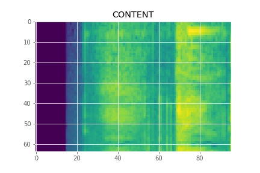
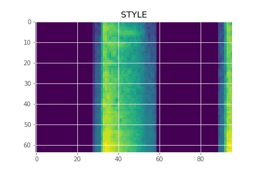

# Audio Style Transfer with Pretrained Convolutional Neural Network

## Introduction

This repository contains a Tensorflow-based implementation of style transfer proposed in "A Neural Algorithm of Artistic Style" by L. Gatys at el. not on images but on audio. The original paper can be found [here](https://arxiv.org/abs/1508.06576).

## Data Representaion

Style transfer is aimed to transfer and recompose the style of one image to the style of another. To implement this technique on audio files, we first have to find a representation for our input and that's when spectrograms come into play. Simply put, spectrograms are able to present audio data information including time, frequency and amplitude in a photographic way. Below are the input spectrograms converted from our input audio files.

 

## VGGish

In the original paper, the authors use VGG as their pre-trained model, but in our implementation we use VGGish, proposed by Hershey at el.. The main reason is that VGG is trained to classify images of objects, while VGGish is used to classify sounds, which more closely matches our need.

The model can be found [here](https://github.com/tensorflow/models/tree/master/research/audioset).
